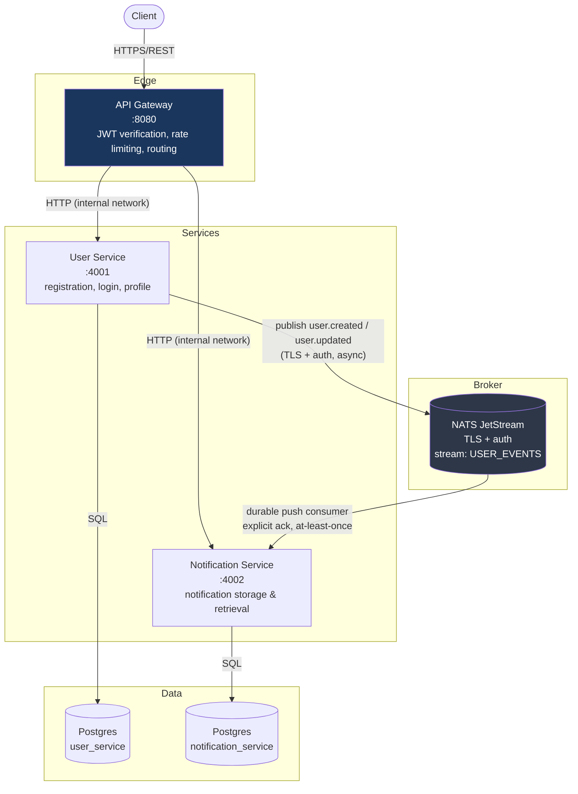
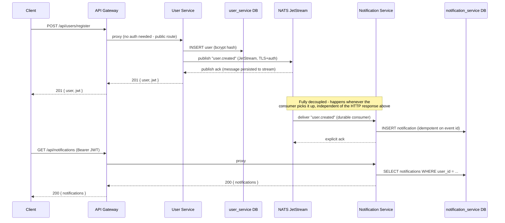

# Architecture

## System overview

Three deployable services, one message broker, two databases:

**The one rule that matters most for this assignment:** the arrow between
User Service and Notification Service does not exist. They have never made
an HTTP call to each other and never will. The only thing connecting them
is the NATS arrow - encrypted, authenticated, asynchronous, and durable.

## Event flow (registration → notification)

The key point to be able to explain live: registration returns to the
client the moment the user row is written and the event is durably
published - it does **not** wait for the Notification Service to consume
and process that event. That's what "asynchronous" means here in practice,
not just in name.

## Why NATS JetStream instead of core NATS or REST

- **Core NATS** (subject pub/sub with no persistence) is fire-and-forget: if
  the Notification Service is down when an event is published, that event
  is gone. That fails the "reliable" requirement outright.
- **REST/webhooks** between services would mean the User Service blocking on
  (or retrying) a call to the Notification Service, coupling their uptime
  together - exactly what the assignment explicitly rules out.
- **JetStream** persists every published message to disk, tracks delivery
  per durable consumer, and only removes a message from the pending queue
  once the consumer explicitly acknowledges it. If Notification Service is
  down for five minutes, it picks up exactly where it left off on restart.

## Reliability mechanisms, concretely

| Concern | Mechanism | Where |
|---|---|---|
| Broker/consumer crash before processing | JetStream persists messages to `/data/jetstream`; durable consumer resumes from last unacked message | `nats-server.conf`, `subscriber.js` |
| Consumer crashes *after* DB write but *before* ack | JetStream redelivers → handler runs again → `ON CONFLICT (source_event_id)` makes the DB write a no-op | `notificationModel.js` |
| Poison message (never processable) | `maxDeliver(5)` stops infinite redelivery attempts | `subscriber.js` |
| Malformed payload | Decoded in a try/catch; acked immediately so it doesn't block the queue, logged loudly | `subscriber.js` |
| Publish-time failure | Registration/update still succeeds (DB is source of truth); failure is logged for follow-up rather than failing the user-facing request | `userController.js` |

## Security, concretely

| Requirement | Implementation |
|---|---|
| Encrypted service-to-broker traffic | NATS server requires TLS on the client port (`nats-server.conf`); self-signed CA for local dev via `scripts/generate-certs.sh`, swap for real certs in production |
| Authenticated broker access | Username/password auth on the NATS server, credentials injected via env vars, never hardcoded |
| Client authentication | JWT (HS256), issued at login, `sub` claim carries the user id |
| Password storage | bcrypt, cost factor 12, never stored or logged in plaintext |
| No REST/WebSocket surface between services | Enforced architecturally - Notification Service has no code path that calls User Service, and vice versa |
| Defense in depth | Both the Gateway *and* each downstream service independently verify the JWT - a service is never one bypassed proxy away from being wide open |
| Rate limiting | Applied at the Gateway, tighter limits specifically on `/register` and `/login` |
| Input validation | Joi schemas on every write endpoint in User Service; Notification Service never accepts arbitrary user-supplied `user_id` (always taken from the verified JWT) |

## Scalability

- Each service is stateless (state lives in Postgres/NATS), so any of the
  three can be horizontally scaled behind the Gateway/broker without
  code changes.
- Database-per-service means User Service and Notification Service scale
  and fail independently - a slow query in one can't lock up the other.
- JetStream naturally supports multiple consumer instances on the same
  durable name for horizontal scaling of the Notification Service (each
  message still goes to exactly one instance).

## What I would add for a longer timeline

Being upfront about the scope cut for a 24-48 hour build, in priority order:
1. A dead-letter subject for messages that exhaust `maxDeliver` instead of
   just dropping them.
2. mTLS (client certs) instead of username/password NATS auth, for true
   mutual authentication.
3. An actual outbox pattern in User Service (write user + outbox row in one
   transaction, separate relay publishes to NATS) to remove the small window
   where the DB write succeeds but the publish fails.
4. Centralized structured logging / tracing across all three services.
